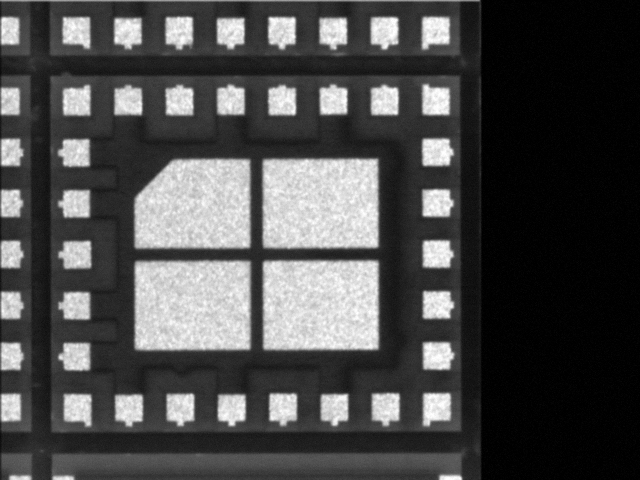
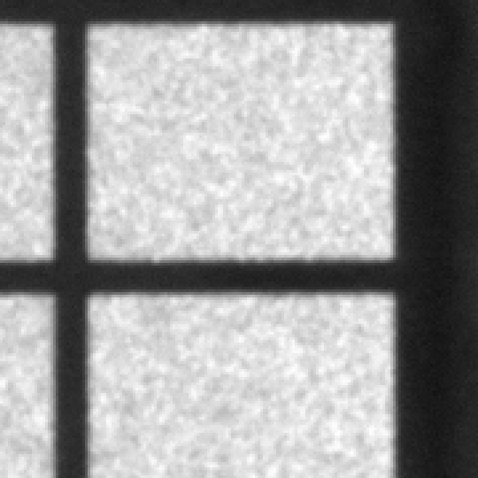
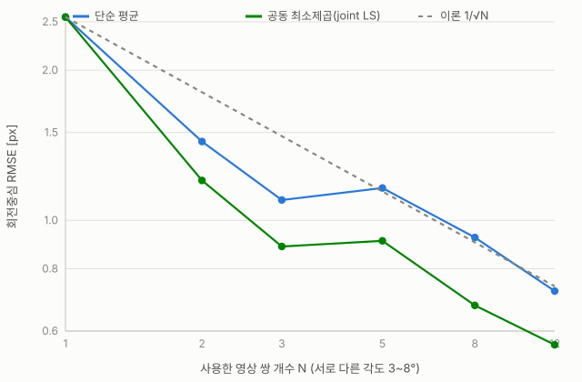
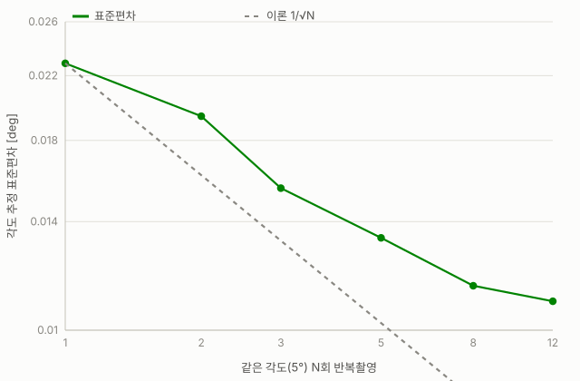
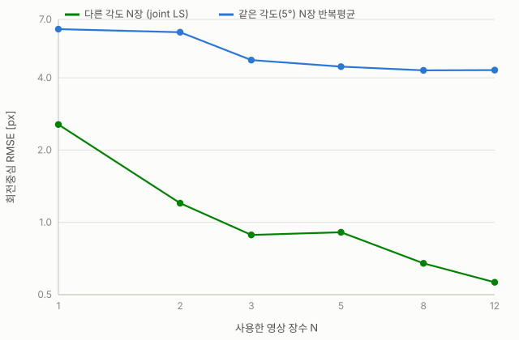

# 회전중심 추정 — 정밀도 분석 리포트

`estimate_rotation_center.py` / `rotate_image_about_center.py`로 만든 회전중심 추정 파이프라인이
**단일 영상쌍**으로 얼마나 정확한지, **여러 장을 결합**하면 얼마나 좋아지는지, 그리고 그 정밀도의
구조적 한계가 무엇인지를 몬테카를로 시뮬레이션으로 검증한 기록이다.

사용법은 [README.md](README.md) 참고. 이 문서는 실험 결과와 해석만 다룬다.

---

## 0. 파이프라인 요약

- **`rotate_image_about_center.py`**: 지정한 회전중심 `(cx, cy)`과 각도로 영상을 실제로 회전시켜
  정답이 알려진 테스트 영상을 생성한다 (`cv2.getRotationMatrix2D` + `warpAffine`).
- **`estimate_rotation_center.py`**: 기준영상과 회전영상 두 장만 보고 회전각·중심을 역산한다.
  1. 각도 coarse→fine 탐색, 각 후보 각도마다 `phaseCorrelate`로 평행이동 추정
  2. overlap NCC로 최적 후보 선택
  3. `(angle, tx, ty, gain, offset)`을 photometric least-squares(Huber loss)로 정밀화
  4. rigid transform의 `(angle, tx, ty)`로부터 회전중심을 선형연립방정식으로 역산
     (`(1-cosθ)cx - sinθ·cy = tx`, `sinθ·cx + (1-cosθ)cy = ty`)

이 4단계 구조가 아래 모든 실험 결과의 근거다 — 특히 4번(회전중심 역산)이 각도가 0에 가까울수록
불안정해진다는 점이 뒤에 나오는 "다른 각도 조합이 유리하다"는 결론의 수학적 이유다.

---

## 1. 노이즈 없는 이상적 조건 — 서브픽셀 정확도의 출처

`truth.json`(정답: angle=5.0°, cx=1234.5, cy=980.2)을 노이즈 없는 순수 워프로 생성해
`estimate_rotation_center.py`로 역산하면:

| 항목 | 정답 | 추정값 | 오차 |
|---|---|---|---|
| angle | 5.000000° | 5.000344° | 0.00034° |
| center_x | 1234.500 px | 1234.450 px | 0.050 px |
| center_y | 980.200 px | 980.191 px | 0.009 px |

두 영상 사이의 유일한 오차원이 큐빅 보간 리샘플링뿐이라 photometric least-squares가 거의 완벽히
역산해낸 결과다. **이건 "노이즈 없는 이상적 조건에서 알고리즘 자체의 자기일관성 테스트"**이지,
실제 카메라로 반복 촬영했을 때의 정확도는 아니다. 아래 2~4절은 이 질문에 답하기 위해
실제 카메라 노이즈를 주입한 결과다.

---

## 2. 노이즈 모델 — 얼마나 교란시켰는가

`simulate_multi_image_precision.py`, `simulate_angle_precision.py` 두 시뮬레이션 모두 매 촬영마다
독립적으로 다음 노이즈를 가한다.

- 가우시안 픽셀 노이즈 σ = 0.01 (0~1 스케일, 8bit 기준 약 2.55 gray level)
- 밝기 gain ~ N(1, 0.02), offset ~ N(0, 0.01)
- 8bit 양자화

| 노이즈 적용 전 | 노이즈 적용 후 |
|---|---|
|  |  |

중앙부 3배 확대 (그레인 확인용):

| 노이즈 적용 전 (확대) | 노이즈 적용 후 (확대) |
|---|---|
|  |  |

실측 결과 두 영상의 평균 절대 밝기차는 **2.07 gray level**(표준편차 1.79) — 육안으로는 미세한
그레인 수준이지만, 서브픽셀 정합 알고리즘 입장에서는 1절의 0.05px급 정확도를 무너뜨리기에
충분한 교란이다.

---

## 3. 실험 A — 서로 다른 각도 N장을 결합해 회전중심 추정

기준영상 1장 + 3~8°/-3~-8° 범위에서 각기 다른 각도로 촬영한 target 영상 최대 12장 (30회 몬테카를로).
N장을 결합하는 두 방법을 비교했다.

- **단순 평균**: 각 영상에서 따로 구한 중심 `(cx_i, cy_i)`의 평균
- **공동 최소제곱(joint LS)**: 각 영상의 `(angle_i, tx_i, ty_i)`를 모아 공유 중심에 대해 선형최소제곱으로 한번에 추정



| N | 단순평균 RMSE [px] | joint LS RMSE [px] | 1/√N 예측 | 개선배율(joint LS) |
|---|---|---|---|---|
| 1 | 2.555 | 2.555 | 2.555 | 1.00× |
| 2 | 1.439 | 1.202 | 1.807 | 2.13× |
| 3 | 1.098 | 0.887 | 1.475 | 2.88× |
| 5 | 1.161 | 0.910 | 1.143 | 2.81× |
| 8 | 0.924 | 0.675 | 0.903 | 3.78× |
| 12 | 0.722 | 0.563 | 0.738 | **4.54×** |

joint LS가 단순 평균보다 항상 더 정밀하고(N=12에서 약 22% 추가 개선), 이론적인 1/√N보다도
좋은 개선을 보인다. 큰 각도로 찍은 영상일수록 연립방정식 계수(`1-cosθ`, `sinθ`)가 커서
자연히 더 큰 가중치를 받기 때문이다.

---

## 4. 실험 B — 같은 각도(5°)를 N번 반복촬영해 회전각 추정

실험 A는 영상마다 각도가 달라 "각도 자체의 반복정밀도"는 잴 수 없다. 그래서 정확히 같은 5°를
N번 독립 촬영해 각도 추정치를 평균하는 고전적 반복측정 시나리오를 별도로 시뮬레이션했다(30회 몬테카를로).



| N | 편향 [deg] | 표준편차 [deg] | RMSE [deg] | 개선배율 | 동일조건 중심 RMSE [px] |
|---|---|---|---|---|---|
| 1 | +0.0107 | 0.0229 | 0.0253 | 1.00× | 6.380 |
| 2 | +0.0145 | 0.0194 | 0.0242 | 1.04× | 6.192 |
| 3 | +0.0101 | 0.0155 | 0.0185 | 1.37× | 4.743 |
| 5 | +0.0110 | 0.0133 | 0.0173 | 1.46× | 4.452 |
| 8 | +0.0120 | 0.0115 | 0.0166 | 1.52× | 4.298 |
| 12 | +0.0125 | 0.0109 | 0.0166 | 1.52× | 4.307 |

표준편차는 N=1→12에서 약 2.1배 줄지만, **편향(0.010~0.013°)은 거의 줄지 않아** N=8부터
RMSE가 0.0166°에서 정체된다 (편향 바닥, bias floor).

### 4-1. 이 바닥은 "작은 이미지"나 "계산 정밀도" 때문이 아니다

시뮬레이션은 속도를 위해 원본 스크립트 기본값(`max_points=30000`, `fine_step=0.02°`)보다
낮춘 설정(`max_points=3000`, `fine_step=0.05°`)을 썼다. 이게 바닥의 원인인지 확인하기 위해
같은 노이즈 영상 15쌍을 두 설정으로 나란히 재분석했다.

| 설정 | 샘플 포인트 | 각도 탐색 간격 | 편향 | 표준편차 |
|---|---|---|---|---|
| 시뮬레이션(축소) | 3,000 | 0.05° | 0.0143° | 0.0255° |
| 원본 기본값(전체) | 30,000 | 0.02° | **0.0201°** | 0.0101° |

포인트를 10배 늘리고 탐색을 촘촘히 해도 **표준편차만 절반 이하로 줄고 편향은 줄지 않았다**
(오히려 미세하게 커짐). 같은 이미지 안에서 샘플링 포인트를 10배 늘렸는데도 편향이 그대로라는 것은,
이 바닥이 정보량 부족(이미지가 작음) 때문이 아니라 **알고리즘 구조 자체의 계통오차**라는 뜻이다.
유력한 원인:

- `refine()`이 `angle/tx/ty`와 함께 **gain·offset(밝기 보정 파라미터)을 동시에 피팅**하는데,
  노이즈+8bit 양자화가 있는 픽셀에서는 광도(photometric) 파라미터와 기하 파라미터(각도) 추정이
  약하게 얽혀(correlated) 작은 계통 편향을 만들어낼 수 있음
- 8bit 양자화 자체가 완전한 가우시안이 아니라 이산적 반올림 오차라서 least-squares가 이를
  완벽히 상쇄하지 못함

**정리**: 표준편차(재현성)는 샘플 수·탐색 정밀도를 올리면 계속 좋아지지만, 편향(정확도 바닥)은
이미지 크기나 계산 정밀도와 무관하게 이 노이즈 모델·피팅 방식 하에서 ~0.01~0.02° 근처에 남는다.

---

## 5. 결정적 비교 — "같은 각도 반복" vs "다른 각도 삼각측량"

동일하게 N=12장을 쓰더라도 회전중심 정밀도 개선폭은 전혀 다르다.



| N | 다른 각도 joint LS RMSE [px] | 개선배율 | 같은 각도(5°) 반복평균 RMSE [px] | 개선배율 |
|---|---|---|---|---|
| 1 | 2.555 | 1.00× | 6.380 | 1.00× |
| 3 | 0.887 | 2.88× | 4.743 | 1.34× |
| 8 | 0.675 | 3.78× | 4.298 | 1.48× |
| 12 | 0.563 | 4.54× | 4.307 | 1.48× |

이유: 회전중심 역산에 쓰이는 2×2 선형계 `[[1-cosθ,-sinθ],[sinθ,1-cosθ]]`는 **고정된 각도에서는
항상 같은 조건수의 계통오차(편향)를 남긴다**. 각도가 다양해지면 이 계통오차의 방향과 크기가
매 영상마다 달라져 평균/최소제곱 과정에서 서로 상쇄된다. 반면 회전각 자체는 이런 행렬 역산이
필요 없는 직접 관측량이라 같은 각도를 반복 촬영하는 것만으로도 표준편차가 착실히 줄어든다
(다만 4-1의 편향 바닥은 그대로 남는다).

---

## 6. 결론 및 권장 사항

1. **노이즈가 없다면** 1쌍만으로 이미 서브픽셀(~0.05~0.2px, ~0.0003°)이다. 여러 장을 더 찍어도
   얻을 게 없다 — "여러 장이 도움되는가"라는 질문 자체가 현실적인 카메라 노이즈를 전제로 한다.
2. **회전중심**을 정밀하게 구하려면 **몇 장을 찍느냐보다 어떤 각도 조합으로 찍느냐가 더 중요하다.**
   같은 각도를 반복 찍으면 N=12여도 겨우 1.48배 개선에 그치지만, 3~8° 범위에서 서로 다른 각도로
   12장을 찍어 joint LS로 결합하면 4.54배 개선된다.
3. **회전각**은 반복 촬영 평균만으로도 표준편차가 꾸준히 개선되지만(N=12에서 ~2.1배),
   현재 파이프라인(gain/offset 동시 피팅 + 8bit 양자화 조건)에서는 **~0.01~0.02° 근처의 편향 바닥이
   구조적으로 존재**한다. 이 바닥을 더 낮추려면 샘플 수를 늘리는 것보다 gain/offset 피팅 방식이나
   양자화 모델 자체를 개선하는 방향이 유효할 것이다.
4. 실무 절차 제안: 3~8°/-3~-8° 범위에서 서로 다른 각도로 8~12장을 촬영 → joint LS로 회전중심
   공동추정 → 회전각은 (가능하다면) 동일 각도 반복촬영 평균으로 별도 검증.

---

## 재현 방법

```bash
pip install -r requirements.txt

# 실험 A: 서로 다른 각도 조합 (회전중심)
python simulate_multi_image_precision.py

# 실험 B: 같은 각도 반복 (회전각/중심)
python simulate_angle_precision.py

# 노이즈 비교 이미지 + 차트 재생성
python make_charts.py

# 인터랙티브 HTML 리포트 (로컬에서 브라우저로 열람)
python build_report.py
```

원시 결과: [`multi_image_precision_result.json`](multi_image_precision_result.json),
[`angle_precision_result.json`](angle_precision_result.json)
실행 로그: [`logs/sim_log.txt`](logs/sim_log.txt), [`logs/sim_angle_log.txt`](logs/sim_angle_log.txt)
인터랙티브 버전: [`rotation_center_multi_image_report.html`](rotation_center_multi_image_report.html) (다운로드 후 로컬에서 열기)
